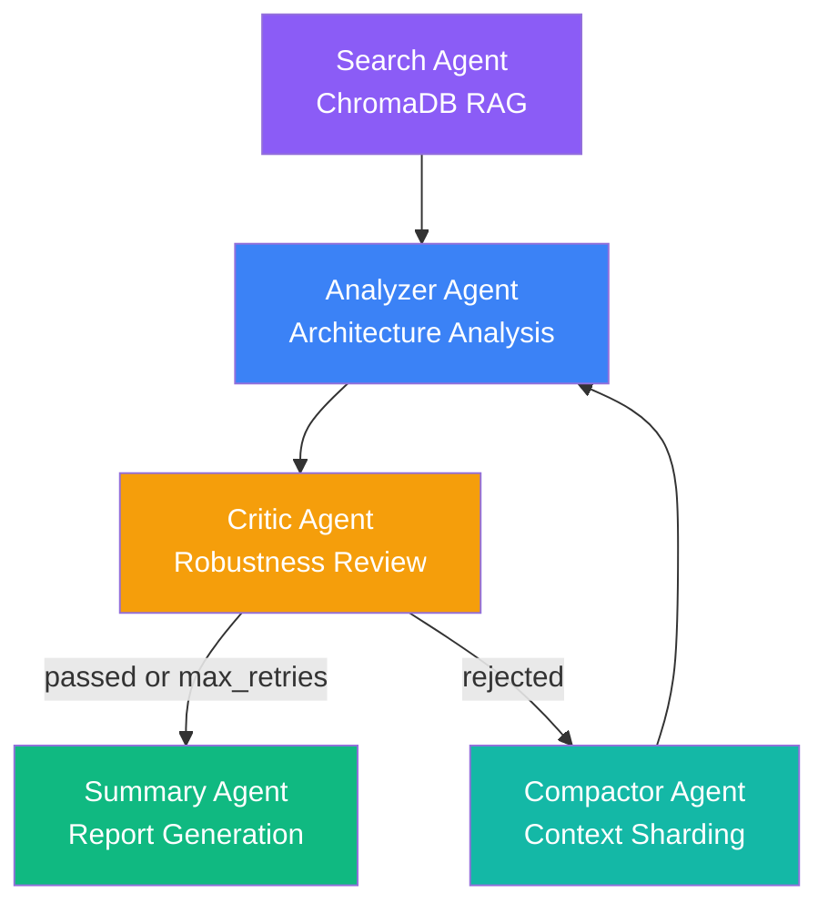
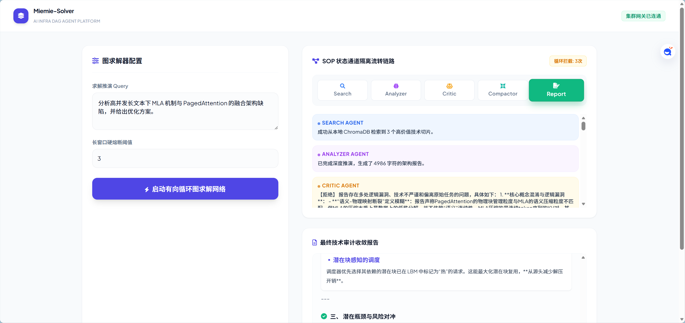

# 🛠️ Miemie-MultiAgent-Solver

> AI Infra Multi-Agent Reflective Solver — 基于 LangGraph 的 AI 基础设施多智能体反思求解平台

[](https://github.com/miemie098/Miemie-MultiAgent-Solver/actions/workflows/test.yml)
[](https://www.python.org/)
[](LICENSE)

A production-oriented multi-agent system that leverages **LangGraph** state graphs, **RAG** (Retrieval-Augmented Generation), and **LLM-powered debate mechanisms** to perform deep architectural analysis and optimization of AI/ML infrastructure problems.

## ✨ Core Features

- **Multi-Agent Reflective Loop**: 5 specialized agents (Search → Analyze → Critique → Compress → Summarize) working collaboratively through a directed cyclic graph
- **RAG-Enhanced Analysis**: Local ChromaDB vector store with 17+ AI research papers (FlashAttention, vLLM, GPTQ, Mixtral, etc.) providing grounded technical context
- **SOP State-Channel Isolation**: Each agent writes exclusively to its own TypedDict channel, preventing state corruption in concurrent executions
- **Context Sharding**: LLM-powered semantic compression prevents prompt-window explosion during multi-round reflective loops
- **Streaming SSE Output**: Real-time agent progress visualization via Server-Sent Events
- **Configurable Modes**: Single-critic mode for cost efficiency; 3-critic debate mode for maximum quality

## 🏗️ Architecture



## 🚀 Quick Start

### Prerequisites
- Python 3.10+
- DeepSeek API Key ([get one here](https://platform.deepseek.com))

### Setup

```bash
# 1. Clone and enter project
git clone <your-repo-url> && cd Miemie-MultiAgent-Solver

# 2. Install dependencies
pip install -r requirements.txt

# 3. Configure environment
cp .env.example .env
# Edit .env and add your DEEPSEEK_API_KEY

# 4. Ingest documents into vector store
python mcp_server/ingest_docs.py

# 5. Start the server
uvicorn app.main:app --reload --port 8000
```

Open `http://localhost:8000` in your browser, enter an AI infrastructure question, and watch the multi-agent DAG solve it in real-time.

### Docker (recommended)

```bash
docker-compose up
```

## 📂 Project Structure

```
├── app/
│   ├── main.py                  # FastAPI server + endpoints
│   ├── index.html               # Frontend dashboard (Tailwind CSS)
│   ├── agents/
│   │   ├── config.py            # LLM factory (singleton pattern)
│   │   ├── search_agent.py      # ChromaDB RAG retrieval
│   │   ├── analyzer_agent.py    # Deep architecture analysis
│   │   ├── critic_agent.py      # Robustness review (JSON-structured output)
│   │   ├── compactor_agent.py   # Semantic context compression
│   │   └── summary_agent.py     # Final report formatting
│   └── graph/
│       ├── state.py             # GraphState TypedDict schema
│       └── workflow.py          # LangGraph DAG topology + routing
├── mcp_server/
│   ├── server.py                # MCP knowledge server
│   └── ingest_docs.py           # PDF/Markdown → ChromaDB pipeline
├── data/
│   ├── chroma_db/               # Persistent vector store
│   ├── pdfs/                    # 17 AI research papers
│   └── markdowns/               # Technical documentation
├── tests/                       # Test suite
├── benchmark/                   # Automated evaluation system
├── requirements.txt             # Python dependencies
├── Dockerfile
├── docker-compose.yml
└── README.md
```

## 🔧 Tech Stack

| Layer | Technology |
|-------|-----------|
| **Agent Framework** | LangGraph 1.2+ |
| **LLM Provider** | DeepSeek-Chat (via OpenAI-compatible API) |
| **Vector Store** | ChromaDB (persistent local) |
| **Embeddings** | all-MiniLM-L6-v2 (via sentence-transformers) |
| **Web Server** | FastAPI + Uvicorn |
| **Frontend** | Vanilla JS + Tailwind CSS CDN |
| **Streaming** | Server-Sent Events (SSE) |
| **Observability** | LangSmith (optional) |

## 📊 Evaluation

Run the automated benchmark to compare agent modes:

```bash
python benchmark/run_benchmark.py
```

This evaluates 4 configurations (single-pass, single-critic, multi-round, debate) across 10+ test cases, scoring faithfulness, relevance, and coherence via LLM-as-judge.

### Benchmark Results

| Mode | Faithfulness | Relevance | Coherence | **Overall** | Avg Time |
|------|:-----------:|:---------:|:---------:|:-----------:|:--------:|
| Baseline (single-pass) | 8.40 | 9.40 | 9.50 | **9.10** | 42s |
| Single Critic | 8.70 | 9.50 | 9.80 | **9.33** | 64s |
| Multi-Round (3 loops) | 7.70 | 8.60 | 9.40 | **8.57** | 95min |
| **Debate (3 critics)** | **8.60** | **9.70** | **10.00** | **9.43** 🏆 | 99s |

**Key findings:**
- 🥇 **Debate mode wins** — 3 parallel critics + moderator consensus outperforms single-critic by +0.10 overall
- 🔄 **Multi-round reflection degrades quality** — repeated Analyzer → Critic loops cause Compactor-driven information loss, reducing faithfulness by 0.7 vs baseline. This validates the debate design: *parallel diverse review beats serial rework*
- ⚡ **Single Critic hits the sweet spot** — 9.33 at only 64s, ideal as production default

> 💡 Open `benchmark/dashboard.html` in a browser for interactive radar/bar charts comparing all 4 modes.

## 📸 Screenshots



> *Real-time agent workflow visualization with SSE streaming. Node-by-node animation as each agent completes.*

---

*Built for production-readiness — not just a prototype.*
