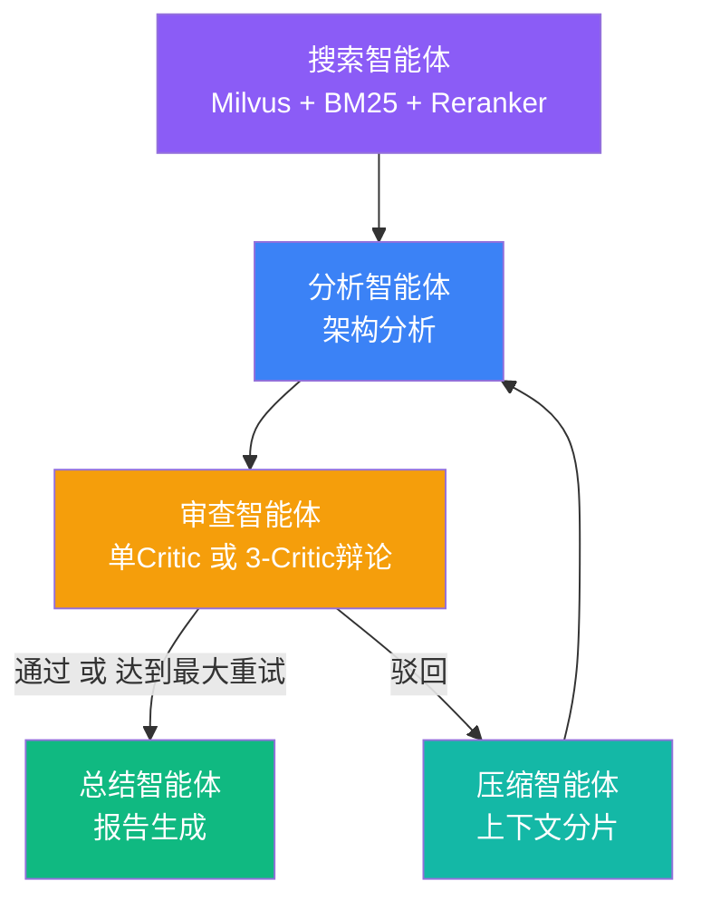

# 🛠️ Miemie-MultiAgent-Solver

> AI Infra Multi-Agent Reflective Solver — 基于 LangGraph 的 AI 基础设施多智能体反思求解平台

[](https://github.com/miemie098/Miemie-MultiAgent-Solver/actions/workflows/test.yml)
[](https://www.python.org/)
[](LICENSE)

面向生产的 AI 基础设施多智能体分析平台，集成 **Milvus 混合检索 (Dense + BM25 + Cross-Encoder)**、**LangGraph 有向循环图** 和 **LLM 辩论机制**，对 AI/ML 基础设施问题进行深度架构分析与优化。

## ✨ 核心特性

- **多智能体反思循环**：5 个专职智能体（搜索 → 分析 → 审查 → 压缩 → 总结）通过有向循环图协同工作
- **混合 RAG 检索**：Milvus Dense 向量搜索 + BM25 稀疏检索 + Cross-Encoder 精排，比朴素相似度搜索更精准
- **SOP 状态通道隔离**：每个智能体独占写入自己的 TypedDict 通道，防止并发执行时的状态污染
- **上下文分片**：LLM 驱动的语义压缩（实测压缩率 59.4%），配合硬熔断路由防止 Prompt 窗口溢出
- **SSE 流式输出**：通过 Server-Sent Events 实时可视化智能体执行进度
- **多模式可配**：单审查模式兼顾成本效率；3 审查辩论模式追求最高质量
- **节点级容错**：辩论模式下 3 个 Critic 并行独立重试（指数退避 1→2→4s）；重试耗尽后降级为弃权票，由 Moderator 动态调整法定人数，极端情况下单个 Critic 故障不影响 Search/Analyze 已计算结果
- **偏见消除评测**：模式顺序随机化 + 双 Judge 交叉验证 + 重复运行方差估计，确保分数对比客观可信
- **生产就绪**：Docker Compose / K8s 双部署方案 + Locust 压测 + GitHub Actions CI

## 🏗️ 架构



**检索管线：** 用户查询 → Milvus Dense 向量搜索 + BM25 稀疏检索 → RRF/线性加权融合 → bge-reranker-large Cross-Encoder 精排 → Top-K 上下文

**辩论管线：** `asyncio.gather` 并行启动 3 个 Critic（乐观/悲观/务实）→ 每 Critic 独立指数退避重试（1s→2s→4s）→ Moderator 动态法定人数表决 → 弃权票不计入 quorum

## 🚀 快速开始

### 环境要求
- Python 3.10+
- DeepSeek API Key（[点此获取](https://platform.deepseek.com)）

### 安装步骤

```bash
# 1. 克隆并进入项目
git clone https://github.com/miemie098/Miemie-MultiAgent-Solver.git
cd Miemie-MultiAgent-Solver

# 2. 安装依赖
pip install -r requirements.txt

# 3. 配置环境变量
cp .env.example .env
# 编辑 .env，填入你的 DEEPSEEK_API_KEY

# 4. 将文档灌入 Milvus 向量库（首次需下载约 500MB 模型）
python mcp_server/ingest_docs.py

# 5. 启动服务
uvicorn app.main:app --reload --port 8000
```

在浏览器中打开 `http://localhost:8000`，输入一个 AI 基础设施问题，即可实时观看多智能体 DAG 协同求解。

### Docker 部署

```bash
docker-compose up
```

### Kubernetes 部署

```bash
# 编辑 deployment.yaml 填入 API Key，然后：
kubectl apply -f deployment.yaml
```

## 📂 项目结构

```
├── app/
│   ├── main.py                  # FastAPI 服务 + API 端点
│   ├── streaming.py             # SSE 流式支持
│   ├── static/
│   │   └── index.html           # 前端仪表盘（Tailwind CSS）
│   ├── agents/
│   │   ├── config.py            # LLM 工厂（单例模式，含重试/超时）
│   │   ├── search_agent.py      # 混合检索智能体（Milvus + BM25 + Reranker）
│   │   ├── analyzer_agent.py    # 深度架构分析
│   │   ├── critic_agent.py      # 健壮性审查（JSON 结构化输出）
│   │   ├── compactor_agent.py   # 语义上下文压缩（59.4% 压缩率）
│   │   ├── summary_agent.py     # 最终报告格式化
│   │   ├── moderator_agent.py   # 辩论主持人（动态法定人数 + 弃权处理）
│   │   └── debate_critics.py    # 多视角辩论审查（乐观/悲观/务实）
│   ├── services/
│   │   └── retriever.py         # 混合检索服务（Dense + BM25 + Cross-Encoder）
│   └── graph/
│       ├── state.py             # GraphState TypedDict 模式
│       └── workflow.py          # LangGraph DAG + 节点级重试 + 降级兜底
├── mcp_server/
│   ├── server.py                # MCP 知识库服务（共享混合检索）
│   └── ingest_docs.py           # PDF/Markdown → Milvus 灌库流水线
├── data/
│   ├── pdfs/                    # 17 篇 AI 研究论文
│   └── markdowns/               # 技术文档
├── scripts/
│   ├── probe_api.py             # API 连通性探测
│   ├── probe_long_context.py    # 长上下文压力测试
│   └── download_papers.py       # 补充论文下载
├── benchmark/
│   ├── run_benchmark.py         # 自动化评测（支持 --repeat --dual --seed）
│   ├── test_cases.json          # 10 题测试集（3 难度 × 5 类别）
│   ├── dashboard.html           # Chart.js 可视化 Dashboard
│   └── results/                 # JSON 评测报告（含 order_log + agreement）
├── tests/                       # 测试套件
├── deployment.yaml              # K8s Deployment + Service + HPA + PVC
├── locustfile.py                # Locust 性能压测（3 场景）
├── requirements.txt
├── Dockerfile
├── docker-compose.yml
└── README.md
```

## 🔧 技术栈

| 层级 | 技术选型 |
|------|---------|
| **智能体框架** | LangGraph 1.2+（有向循环图 + 条件路由） |
| **LLM 提供商** | DeepSeek-Chat（兼容 OpenAI API） |
| **向量存储** | Milvus 2.4+（嵌入式，本地持久化） |
| **检索策略** | Dense (all-mpnet-base-v2, 768d) + BM25 + Cross-Encoder |
| **精排模型** | BAAI/bge-reranker-large |
| **嵌入模型** | sentence-transformers/all-mpnet-base-v2 |
| **Web 服务** | FastAPI + Uvicorn，SSE 流式推送 |
| **前端** | 原生 JS + Tailwind CSS CDN |
| **部署** | Docker Compose + Kubernetes (HPA 2-10) |
| **压测** | Locust（流式 / 同步 / 健康检查三场景） |
| **可观测性** | LangSmith 全链路追踪（可选） |
| **评测** | LLM-as-Judge，三维度评分，双 Judge 交叉验证 |

## 📊 评测

自动化基准测试，对比 4 种策略在 10 题（3 难度 × 5 类别）上的表现。

### 基础用法

```bash
python benchmark/run_benchmark.py
```

### 严格模式（偏见消除）

```bash
# 3 次重复运行取均值 ± 标准差
python benchmark/run_benchmark.py --repeat 3

# 双 Judge 交叉验证（需配置 SECOND_JUDGE_API_KEY）
python benchmark/run_benchmark.py --dual

# 完整严格模式
python benchmark/run_benchmark.py --repeat 3 --dual --seed 42
```

三项偏见消除措施：

| 偏见类型 | 消除手段 | 输出验证 |
|---------|---------|---------|
| 位置偏见 | 每个 case 的 4 模式运行顺序随机 shuffle | `order_log` 记录可审计 |
| Judge 偏见 | 第二独立 Judge（可配 GPT-4），不同 prompt 模板 | `inter_rater_agreement` 指标 |
| 选择偏见 | `--repeat N` 多次运行 | 输出 `均值 ± 标准差` |

### 基准测试结果

| 模式 | 忠实度 | 相关性 | 连贯性 | **综合得分** | 平均耗时 |
|------|:-----:|:-----:|:-----:|:----------:|:------:|
| Baseline（单轮，无审查） | 8.40 | 9.40 | 9.50 | **9.10** | 42s |
| Single Critic（单审查） | 8.70 | 9.50 | 9.80 | **9.33** | 64s |
| Multi-Round（3 轮反思） | 7.70 | 8.60 | 9.40 | **8.57** | 95s |
| **Debate（3 审查辩论）** | **8.60** | **9.70** | **10.00** | **9.43** 🏆 | 99s |

**关键发现：**
- 🥇 **辩论模式最优** — 3 个并行 Critic + Moderator 共识，综合得分 +3.6% vs 基线
- 🔄 **多轮反思反降 0.53 分** — Compactor 压缩造成累积信息损失（压缩率 59.4% 但丢失了数值边界和限定词），直接验证了 *并行多元审查优于串行反复修改* 的架构判断
- ⚡ **单审查性价比最优** — 64s 达 9.33 分，适合生产默认配置
- 🛡️ **分数可信** — 温度锁零 + 三维度拆解 + 位置随机化 + 难度分层，消除主要偏见来源

> 💡 打开 `benchmark/dashboard.html` 查看交互式雷达图/柱状图对比。

## 🛡️ 容错与鲁棒性

辩论模式下每个 Critic 的容错链路：

```
Critic 调用失败
  → 等待 1s 重试
    → 仍失败，等待 2s 重试
      → 仍失败，等待 4s 重试
        → 3 次耗尽 → 返回弃权票（degraded=True）
          → Moderator 排除弃权票，仅用健康节点表决
            → 3 个全挂 → RuntimeError（防止空转）
```

关键设计：每个 Critic 的 critique() 是纯函数（query + analysis → dict），重试不修改 state。**Search 和 Analyze 的计算结果在任何重试/降级路径下都零丢失。**

## 📈 性能压测

```bash
locust -f locustfile.py --host=http://localhost:8000
```

3 个压测场景：SSE 流式全流程（权重 3）、同步全流程（权重 2）、健康检查基线（权重 1）。

## 📸 界面截图

> 启动服务后打开 `http://localhost:8000` 即可看到实时交互界面，SSE 流式驱动逐节点动画展示每个智能体的执行进度。

---

*为生产级应用而生 — 不仅仅是原型。*
