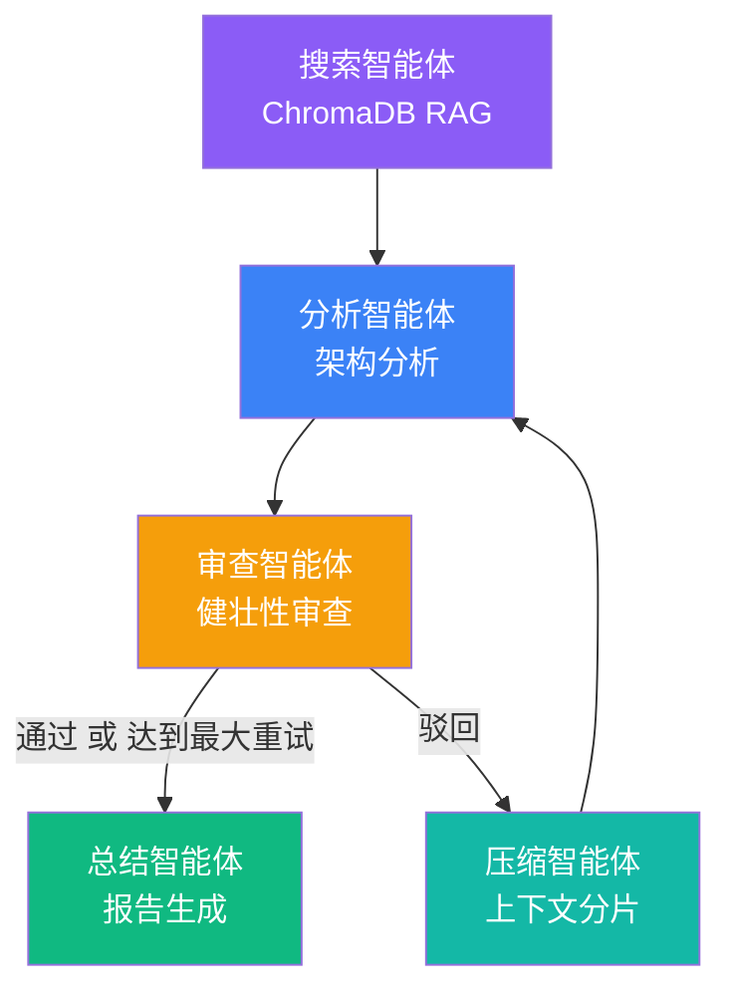

# 🛠️ Miemie-MultiAgent-Solver

> AI Infra Multi-Agent Reflective Solver — 基于 LangGraph 的 AI 基础设施多智能体反思求解平台

[](https://github.com/miemie098/Miemie-MultiAgent-Solver/actions/workflows/test.yml)
[](https://www.python.org/)
[](LICENSE)

面向生产的 AI 基础设施多智能体分析平台，利用 **LangGraph** 状态图、**RAG**（检索增强生成）和 **LLM 驱动的辩论机制**，对 AI/ML 基础设施问题进行深度架构分析与优化。

## ✨ 核心特性

- **多智能体反思循环**：5 个专职智能体（搜索 → 分析 → 审查 → 压缩 → 总结）通过有向循环图协同工作
- **RAG 增强分析**：本地 ChromaDB 向量库收录 17+ 篇 AI 研究论文（FlashAttention、vLLM、GPTQ、Mixtral 等），提供有据可依的技术上下文
- **SOP 状态通道隔离**：每个智能体独占写入自己的 TypedDict 通道，防止并发执行时的状态污染
- **上下文分片**：LLM 驱动的语义压缩，防止多轮反思循环中提示窗口膨胀
- **SSE 流式输出**：通过 Server-Sent Events 实时可视化智能体执行进度
- **多模式可配**：单审查模式兼顾成本效率；3 审查辩论模式追求最高质量

## 🏗️ 架构



## 🚀 快速开始

### 环境要求
- Python 3.10+
- DeepSeek API Key（[点此获取](https://platform.deepseek.com)）

### 安装步骤

```bash
# 1. 克隆并进入项目
git clone <your-repo-url> && cd Miemie-MultiAgent-Solver

# 2. 安装依赖
pip install -r requirements.txt

# 3. 配置环境变量
cp .env.example .env
# 编辑 .env，填入你的 DEEPSEEK_API_KEY

# 4. 将文档灌入向量库
python mcp_server/ingest_docs.py

# 5. 启动服务
uvicorn app.main:app --reload --port 8000
```

在浏览器中打开 `http://localhost:8000`，输入一个 AI 基础设施问题，即可实时观看多智能体 DAG 协同求解。

### Docker 部署（推荐）

```bash
docker-compose up
```

## 📂 项目结构

```
├── app/
│   ├── main.py                  # FastAPI 服务 + API 端点
│   ├── streaming.py             # SSE 流式支持
│   ├── static/
│   │   └── index.html           # 前端仪表盘（Tailwind CSS）
│   ├── agents/
│   │   ├── config.py            # LLM 工厂（单例模式）
│   │   ├── search_agent.py      # ChromaDB RAG 检索
│   │   ├── analyzer_agent.py    # 深度架构分析
│   │   ├── critic_agent.py      # 健壮性审查（JSON 结构化输出）
│   │   ├── compactor_agent.py   # 语义上下文压缩
│   │   ├── summary_agent.py     # 最终报告格式化
│   │   ├── moderator_agent.py   # 辩论主持人
│   │   └── debate_critics.py    # 多视角辩论审查
│   └── graph/
│       ├── state.py             # GraphState TypedDict 模式
│       └── workflow.py          # LangGraph DAG 拓扑与路由
├── mcp_server/
│   ├── server.py                # MCP 知识库服务
│   └── ingest_docs.py           # PDF/Markdown → ChromaDB 灌库流水线
├── data/
│   ├── chroma_db/               # 持久化向量库
│   ├── pdfs/                    # 17 篇 AI 研究论文
│   └── markdowns/               # 技术文档
├── scripts/
│   ├── probe_api.py             # API 连通性探测
│   ├── probe_long_context.py    # 长上下文压力测试
│   └── download_papers.py       # 补充论文下载
├── tests/                       # 测试套件
├── benchmark/                   # 自动化评测系统
├── requirements.txt             # Python 依赖
├── Dockerfile
├── docker-compose.yml
└── README.md
```

## 🔧 技术栈

| 层级 | 技术选型 |
|------|---------|
| **智能体框架** | LangGraph 1.2+ |
| **LLM 提供商** | DeepSeek-Chat（兼容 OpenAI API） |
| **向量存储** | ChromaDB（本地持久化） |
| **嵌入模型** | all-MiniLM-L6-v2（通过 sentence-transformers） |
| **Web 服务** | FastAPI + Uvicorn |
| **前端** | 原生 JS + Tailwind CSS CDN |
| **流式传输** | Server-Sent Events (SSE) |
| **可观测性** | LangSmith（可选） |

## 📊 评测

运行自动化基准测试，对比各智能体模式：

```bash
python benchmark/run_benchmark.py
```

对 4 种配置（单轮、单审查、多轮反思、辩论模式）在 10+ 个测试用例上进行评测，通过 LLM-as-Judge 对忠实度、相关性和连贯性进行打分。

### 基准测试结果

| 模式 | 忠实度 | 相关性 | 连贯性 | **综合得分** | 平均耗时 |
|------|:-----:|:-----:|:-----:|:----------:|:------:|
| Baseline（单轮） | 8.40 | 9.40 | 9.50 | **9.10** | 42s |
| Single Critic（单审查） | 8.70 | 9.50 | 9.80 | **9.33** | 64s |
| Multi-Round（3 轮反思） | 7.70 | 8.60 | 9.40 | **8.57** | 95min |
| **Debate（3 审查辩论）** | **8.60** | **9.70** | **10.00** | **9.43** 🏆 | 99s |

**关键发现：**
- 🥇 **辩论模式最优** — 3 个并行审查 + 主持人共识，综合得分超出单审查模式 +0.10
- 🔄 **多轮反思反而降低质量** — 反复的分析→审查循环导致压缩环节信息丢失，忠实度相比基线下降 0.7。这验证了设计理念：*并行多元审查优于串行反复修改*
- ⚡ **单审查模式性价比最高** — 仅 64 秒达到 9.33 分，适合作为生产环境默认配置

> 💡 在浏览器中打开 `benchmark/dashboard.html`，可查看 4 种模式的交互式雷达图/柱状图对比。

## 📸 界面截图


> *SSE 流式驱动的实时智能体工作流可视化，每个智能体完成后逐节点动画展示。*

---

*为生产级应用而生 — 不仅仅是原型。*
